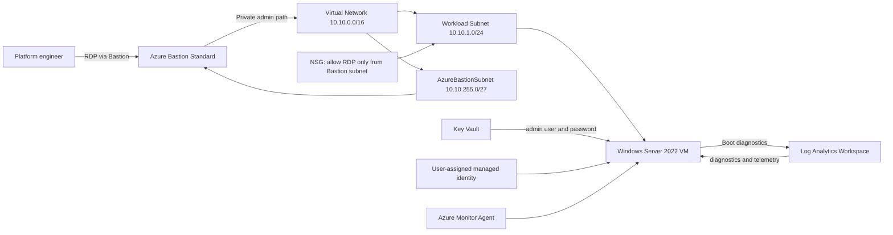

# Architecture overview

## Deployment objectives

This landing zone pattern keeps a single hardened Windows workload in a secure, private network and uses Azure Bastion as the sole administration path. The solution is designed to support PR-based infrastructure change review and cost visibility using Infracost.

## Core components

- Resource group for the workload environment
- VNet with a dedicated workload subnet and AzureBastionSubnet
- NSG that restricts inbound RDP to the Bastion subnet
- Azure Bastion Standard with a dedicated public IP
- Key Vault using RBAC authorization with purge protection and soft delete enabled
- Log Analytics Workspace for centralized telemetry and diagnostics
- One or more Windows Server 2022 VMs with no public IP
- User-assigned managed identity on the VM
- Azure Monitor Agent for platform visibility
- Boot diagnostics and Trusted Launch features enabled

## Network topology

The environment uses a classic hub/spoke pattern in miniature:

- VNet address space: 10.10.0.0/16
- Workload subnet: 10.10.1.0/24
- Azure Bastion subnet: 10.10.255.0/27

The public entry point is Azure Bastion, not the VM itself. The VM has no public IP and is reachable only through the private network path.

## Diagram

## Why this pattern is secure

- The VM is private by default with no public endpoint
- Azure Bastion provides a controlled administrative path and reduces direct exposure
- NSG rules limit management traffic to the Bastion subnet only
- Secrets are stored in Key Vault instead of being embedded in the template
- Managed identity reduces the need for shared credentials and service principals
- Boot diagnostics and guest telemetry provide operational assurance

## Region strategy

The default region is UK South, but the parameter is configurable. This helps demonstrate multi-region flexibility while preserving a secure enterprise pattern appropriate for Five Eyes-compliant deployment locations.

## Cost model and design for Infracost

The architecture is intentionally parameterized so infrastructure changes can be reflected in cost deltas:

- `vmSize`
- `vmCount`
- `premiumDataDiskSizeGiB`
- `bastionSku`
- `logAnalyticsRetentionInDays`
- Additional data disks

These variables make it easy to show a before-and-after cost delta in PR comments.
